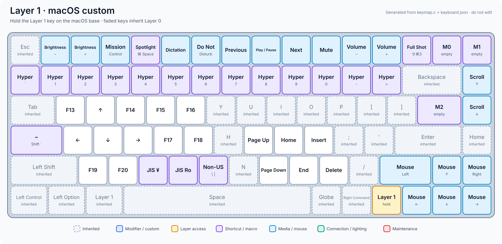
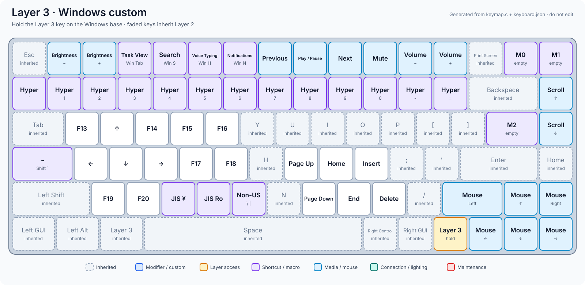

# Yu's Air75 V2 keymap

This keymap is the source of truth for the keyboard layout. VIA remains enabled
for temporary experiments, but importing a VIA layout is not required after
flashing this keymap.

## Build

```sh
qmk compile -kb nuphy/air75_v2/ansi -km yu
```

## Layers

- 0: macOS base
- 1: macOS custom layer
- 2: Windows base
- 3: Windows custom layer
- 4-5: reserved
- 6: shared connection, lighting, and maintenance controls
- 7: reserved

## Layout diagrams

These diagrams are generated from `keymap.c` and the physical geometry in
`keyboard.json`. Faded, dashed keys pass through to a lower layer. Layers 4, 5,
and 7 are reserved and are therefore omitted.

### Layer 0: macOS


### Layer 1: macOS custom



### Layer 2: Windows


### Layer 3: Windows custom



### Layer 6: Common


Regenerate the diagrams from the repository root after changing the compiled
layout:

```sh
python3 keyboards/nuphy/air75_v2/ansi/keymaps/yu/tools/render_layouts.py --png
```

The SVG files are the primary documentation. `--png` also writes convenient
raster copies when `rsvg-convert` is installed. To verify that committed SVGs
still match the source without changing files, run:

```sh
python3 keyboards/nuphy/air75_v2/ansi/keymaps/yu/tools/render_layouts.py --check
```

The bottom-row bindings are:

- macOS: `Control | Option | Layer 1 | Space | Globe | Command | Layer 6`
- Windows: `GUI | Alt | Layer 3 | Space | Right Control | Right GUI | Layer 6`

The macOS Globe key is a dedicated held key, not a tap action. It sends the
Apple keyboard-layout-select consumer usage from physical press through
physical release, allowing native combinations such as Globe-C, Globe-H,
Globe-N, and Globe-Q. The shared USB endpoint keeps Globe and ordinary keyboard
reports associated for combinations in wired mode.

Layer 6's `/?` key sends the built-in help text in both macOS and Windows
modes. VIA macro slots M0, M1, and M2 keep their existing key assignments but
are empty by default.

## Caps: Esc or modifier

The Caps-position key uses a dedicated state machine instead of QMK Mod-Tap:

- Press and release it without pressing another key to send Escape, regardless
  of how long it was held.
- Press another key while holding it to use left Command on macOS or left
  Control on Windows. The modifier is registered before the other key.
- Escape taps use a non-blocking 24 ms key-down pulse and an 8 ms gap between
  queued taps, so rapid repeated taps remain distinct and RF housekeeping can
  continue running.

An external mouse click is not visible to the keyboard state machine, so use a
regular Command or Control key for modifier-plus-mouse gestures.

When changing the compiled layout, bump `YU_LAYOUT_REVISION` in `config.h`.
This forces the new defaults into VIA's dynamic-keymap EEPROM even when two
firmware builds are flashed on the same day.
