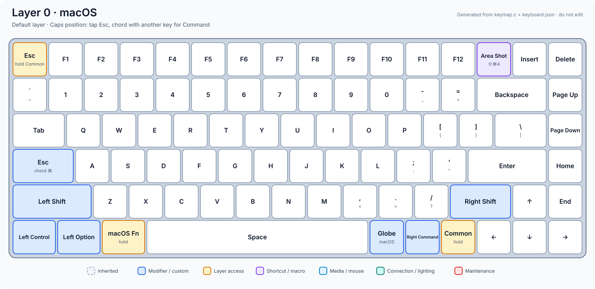
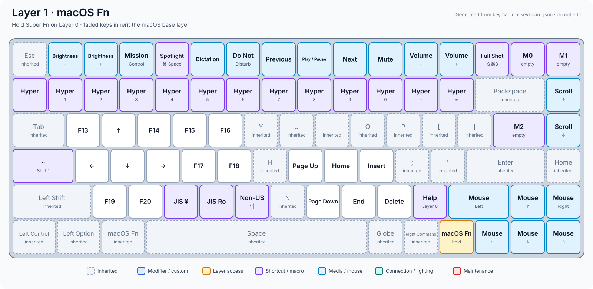
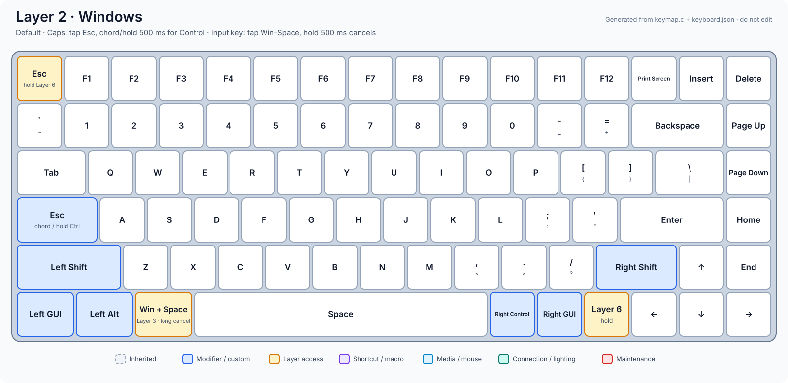
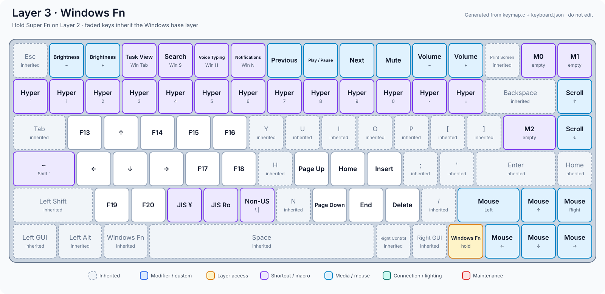
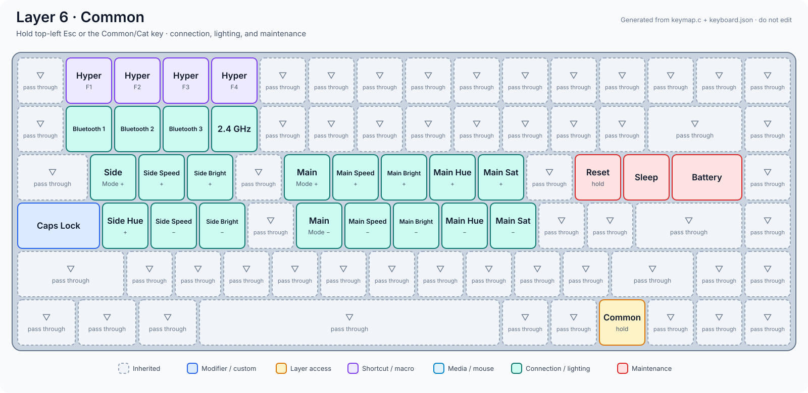

# Yu's NuPhy Air75 V2 firmware

This repository contains a personal QMK firmware and source-controlled keymap
for the **NuPhy Air75 V2 ANSI**. The default branch is intended to build the
`yu` keymap; it is not a general-purpose replacement for upstream QMK.

The firmware is based directly on
[jincao1's `air75v2-sleep` branch](https://github.com/jincao1/qmk_firmware/tree/air75v2-sleep),
starting from commit
[`5818bd6`](https://github.com/jincao1/qmk_firmware/commit/5818bd6df659b3919f834f58fe4134aa11aca2b6).
jincao1's work provides the Air75 V2 firmware base, wireless/RF handling, and
sleep-related changes on which this keymap is built.

The [NuPhy QMK source](https://github.com/nuphy-src/qmk_firmware) and
[upstream QMK](https://github.com/qmk/qmk_firmware) remain important references.
See [QMK's official documentation](https://docs.qmk.fm/) for general setup,
building, flashing, and development information.

## What this fork adds

- A compiled, source-controlled eight-layer keymap, so the intended layout is
  restored by flashing without importing a VIA JSON file.
- A Caps-position chord state machine: press and release for Escape, or hold it
  while pressing another key for Command on macOS and Control on Windows.
- A dedicated macOS Globe key that supports native Globe shortcuts.
- A shared layer for wireless connections, lighting controls, maintenance, and
  an on-keyboard help entry.
- Diagrams generated directly from `keymap.c` and the keyboard's physical
  geometry, keeping the documentation tied to the firmware source.

Implementation details and regeneration instructions are in the
[`yu` keymap documentation](keyboards/nuphy/air75_v2/ansi/keymaps/yu/readme.md).

## Build

Clone with submodules, install the QMK CLI following the
[included QMK setup guide](docs/newbs_getting_started.md), and run from the
repository root:

```sh
qmk compile -kb nuphy/air75_v2/ansi -km yu
```

The resulting firmware is `nuphy_air75_v2_ansi_yu.bin`.

## Layers

- **0:** macOS base
- **1:** macOS function layer
- **2:** Windows base
- **3:** Windows function layer
- **4-5:** reserved
- **6:** shared connection, lighting, and maintenance controls
- **7:** reserved

Faded, dashed keys in the diagrams pass through to a lower layer. Reserved
layers are intentionally omitted.

### Layer 0: macOS



### Layer 1: macOS Fn



### Layer 2: Windows



### Layer 3: Windows Fn



### Layer 6: Common



## Credits

- [Jin Cao / jincao1](https://github.com/jincao1) for the Air75 V2 firmware
  branch used as this repository's direct base.
- [NuPhy](https://github.com/nuphy-src/qmk_firmware) for its published keyboard
  firmware sources.
- [QMK](https://github.com/qmk/qmk_firmware) and its contributors for the
  firmware framework.

This is an unofficial personal firmware project and is not affiliated with or
supported by NuPhy, jincao1, or the QMK project.
